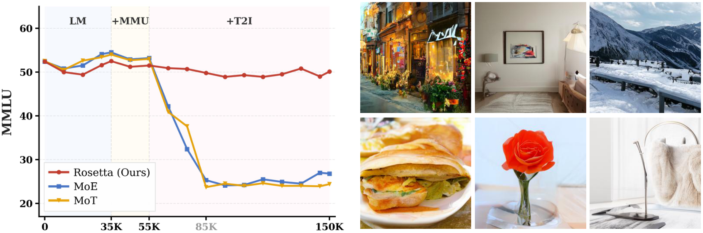
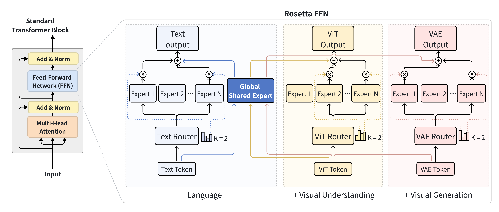
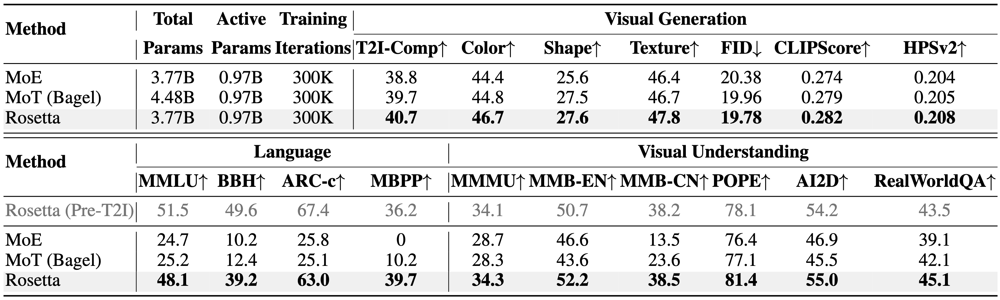

<div align="center">

# 🪨 Rosetta: Composable Native Multimodal Pretraining

<p align="center">
  <a href="https://rosetta-lmm.github.io/">
    
  </a>
 &nbsp;
  <a href="https://arxiv.org/abs/XXXX.XXXXX">
    
  </a>
  &nbsp;
  <a href="https://huggingface.co/tencent/Rosetta-inference">
    
  </a>
  &nbsp;
  
</p>

<p align="center">
  <b>Escaping the Forgetting-Synergy Dilemma in Native Multimodal Pretraining</b>
</p>

<p align="center">
  <a href="https://xiangyueliu.github.io/">Xiangyue Liu</a><sup>1</sup>,
  <a href="https://scholar.google.com/citations?user=TZ0nnhgAAAAJ&hl=zh-CN">Zijian Zhang</a><sup>2</sup>,
  <a href="https://openreview.net/profile?id=~Miles_Yang2">Miles Yang</a><sup>2</sup>,
  <a href="https://scholar.google.com/citations?user=igtXP_kAAAAJ&hl=en">Zhao Zhong</a><sup>2</sup>,
  <a href="https://scholar.google.com/citations?user=FJwtMf0AAAAJ&hl=en">Liefeng Bo</a><sup>2</sup>,
  <a href="https://scholar.google.com/citations?user=XhyKVFMAAAAJ&hl=en">Ping Tan</a><sup>1*</sup>
</p>
<p align="center">
  <sup>1</sup>HKUST &nbsp;&nbsp; <sup>2</sup>Tencent Hunyuan
</p>

</div>


<p align="center">
  
</p>

> **Figure 1.** *(Left)* Performance on MMLU (Language Ability) across composable pretraining stages (LM → +MMU → +T2I). Standard MoE and structurally-isolated MoT suffer catastrophic routing collapse upon integrating continuous generative objectives. **Rosetta maintains a stable semantic anchor throughout all stages.** *(Right)* Qualitative image generation results from the Rosetta model.

---


## 🏗️ Architecture

<p align="center">
  
</p>

> **Figure 2. Rosetta FFN.** Three mechanisms enable non-destructive modality expansion: **(1) Unified Attention** — globally shared QKV projections preserve dense cross-modal interactions. **(2) Composable FFN** — modality-specific plug-and-play experts (Text / ViT / VAE) are bridged by a single Global Shared Expert that anchors foundational knowledge. **(3) Conflict-Free Optimization (MAOP)** — surgically neutralizes destructive gradients with zero memory overhead.


---

## 🚀 Quick Start

### 1. Environment Setup

**Requirements:** Python 3.12+, CUDA 12.8+

```bash
conda create -n rosetta python=3.12 -y
conda activate rosetta

# 1. Install PyTorch using your CUDA version
pip install torch==2.7.1 torchvision==0.22.1 torchaudio==2.7.1 --index-url https://download.pytorch.org/whl/cu128

# 2. Install dependencies
pip install -r requirements.txt

# 3. Install Flash Attention (required; takes ~20 mins to compile)
FLASH_ATTENTION_FORCE_BUILD=TRUE MAX_JOBS=8 pip install flash-attn==2.8.1 --no-build-isolation --no-binary flash-attn --no-cache-dir

```

### 2. Download Weights and Assets

Evaluation requires a **model checkpoint** and the **shared assets** (VAE, ViT, tokenizer, and evaluation datasets).

**Step 1 — Download shared assets** (required by all models, download once):
```bash
hf download tencent/Rosetta-inference public_assets.zip --local-dir . && unzip -o public_assets.zip && rm public_assets.zip
```

**Step 2 — Download model checkpoint** (example: main Rosetta model):
```bash
hf download tencent/Rosetta-inference --include "checkpoints/Rosetta-3.8B-A1B/**" --local-dir .
```

See [§ Model Checkpoints](#-model-checkpoints) for the full list of 15 checkpoints.

By default, the evaluation scripts look for assets under `./public_assets` and checkpoints under `./checkpoints/Rosetta-3.8B-A1B`. You can place them anywhere on disk and pass their locations via environment variables:

```bash
# Use the default ./public_assets and ./checkpoints/Rosetta-3.8B-A1B paths.
bash scripts/eval/eval_arc_c.sh

# Or override the paths explicitly.
ASSETS_BASE=/your/path/public_assets EXP=/your/path/checkpoints/Rosetta-3.8B-A1B bash scripts/eval/eval_arc_c.sh
```

`ASSETS_BASE` defaults to `./public_assets` and `EXP` defaults to `./checkpoints/Rosetta-3.8B-A1B` (relative to repo root) if not set.

<details>
<summary><b>Expected directory layout</b></summary>

```
/your/path/
├── checkpoints/
│   ├── Rosetta-3.8B-A1B/
│   │   └── hf_weights/         ← safetensors model weights
│   ├── MoE-3.8B-A1B/
│   └── MoT-4.5B-A1B/
└── public_assets/
    ├── image_encoder/          ← VAE (flux2-vae, ...)
    ├── vision_encoder/         ← ViT (Qwen3-VL-30B-A3B-Instruct)
    ├── pretrained_llm/         ← tokenizer + Qwen3-0.6B-Base
    ├── generation_configs/     ← generation settings for evaluation
    └── evaluation/             ← benchmark datasets
        ├── ARC_C/
        ├── MMLU/
        ├── BBH/
        ├── MBPP/
        ├── MMMU/
        ├── MMBench/
        ├── POPE/
        ├── AI2D/
        ├── RealWorldQA/
        └── T2I-CompBench/
```

</details>

---

## 📦 Model Checkpoints

For most use cases, download the full Stage 3 model:

| Checkpoint | Capabilities | Total / Active | HuggingFace |
|:-----------|:-------------|:--------------:|:-----------:|
| Rosetta-3.8B-A1B | LM + MMU + T2I | 3.8B / 0.97B | 🤗 [Download](https://huggingface.co/tencent/Rosetta-inference/tree/main/checkpoints/Rosetta-3.8B-A1B) |
| MoE-3.8B-A1B | LM + MMU + T2I | 3.8B / 0.97B | 🤗 [Download](https://huggingface.co/tencent/Rosetta-inference/tree/main/checkpoints/MoE-3.8B-A1B) |
| MoT-4.5B-A1B | LM + MMU + T2I | 4.5B / 0.97B | 🤗 [Download](https://huggingface.co/tencent/Rosetta-inference/tree/main/checkpoints/MoT-4.5B-A1B) |

<details>
<summary><b>Full checkpoint list — all 15 models across 3 architectures × 5 training stages, plus the MoT Stage 3 init checkpoint</b></summary>
<br>
| Checkpoint | Stage | Iter | Total / Active | HuggingFace |
|:-----------|:------|-----:|:--------------:|:-----------:|
| Rosetta-3.8B-A1B-init | Upcycling init | 0 | 3.8B / 0.97B | 🤗 [Download](https://huggingface.co/tencent/Rosetta-inference/tree/main/checkpoints/Rosetta-3.8B-A1B-init) |
| Rosetta-3.8B-A1B-stage1-lm | LM | 35K | 3.8B / 0.97B | 🤗 [Download](https://huggingface.co/tencent/Rosetta-inference/tree/main/checkpoints/Rosetta-3.8B-A1B-stage1-lm) |
| Rosetta-3.8B-A1B-stage2-lm-mmu-warmup | LM+MMU warmup | 3K | 3.8B / 0.97B | 🤗 [Download](https://huggingface.co/tencent/Rosetta-inference/tree/main/checkpoints/Rosetta-3.8B-A1B-stage2-lm-mmu-warmup) |
| Rosetta-3.8B-A1B-stage2-lm-mmu | LM+MMU | 20K | 3.8B / 0.97B | 🤗 [Download](https://huggingface.co/tencent/Rosetta-inference/tree/main/checkpoints/Rosetta-3.8B-A1B-stage2-lm-mmu) |
| Rosetta-3.8B-A1B | LM+MMU+T2I | 400K | 3.8B / 0.97B | 🤗 [Download](https://huggingface.co/tencent/Rosetta-inference/tree/main/checkpoints/Rosetta-3.8B-A1B) |
| MoE-3.8B-A1B-init | Upcycling init | 0 | 3.8B / 0.97B | 🤗 [Download](https://huggingface.co/tencent/Rosetta-inference/tree/main/checkpoints/MoE-3.8B-A1B-init) |
| MoE-3.8B-A1B-stage1-lm | LM | 35K | 3.8B / 0.97B | 🤗 [Download](https://huggingface.co/tencent/Rosetta-inference/tree/main/checkpoints/MoE-3.8B-A1B-stage1-lm) |
| MoE-3.8B-A1B-stage2-lm-mmu-warmup | LM+MMU warmup | 3K | 3.8B / 0.97B | 🤗 [Download](https://huggingface.co/tencent/Rosetta-inference/tree/main/checkpoints/MoE-3.8B-A1B-stage2-lm-mmu-warmup) |
| MoE-3.8B-A1B-stage2-lm-mmu | LM+MMU | 20K | 3.8B / 0.97B | 🤗 [Download](https://huggingface.co/tencent/Rosetta-inference/tree/main/checkpoints/MoE-3.8B-A1B-stage2-lm-mmu) |
| MoE-3.8B-A1B | LM+MMU+T2I | 400K | 3.8B / 0.97B | 🤗 [Download](https://huggingface.co/tencent/Rosetta-inference/tree/main/checkpoints/MoE-3.8B-A1B) |
| MoT-4.5B-A1B-init | Upcycling init | 0 | 4.5B / 0.97B | 🤗 [Download](https://huggingface.co/tencent/Rosetta-inference/tree/main/checkpoints/MoT-4.5B-A1B-init) |
| MoT-4.5B-A1B-stage1-lm | LM | 35K | 4.5B / 0.97B | 🤗 [Download](https://huggingface.co/tencent/Rosetta-inference/tree/main/checkpoints/MoT-4.5B-A1B-stage1-lm) |
| MoT-4.5B-A1B-stage2-lm-mmu-warmup | LM+MMU warmup | 3K | 4.5B / 0.97B | 🤗 [Download](https://huggingface.co/tencent/Rosetta-inference/tree/main/checkpoints/MoT-4.5B-A1B-stage2-lm-mmu-warmup) |
| MoT-4.5B-A1B-stage2-lm-mmu | LM+MMU | 20K | 4.5B / 0.97B | 🤗 [Download](https://huggingface.co/tencent/Rosetta-inference/tree/main/checkpoints/MoT-4.5B-A1B-stage2-lm-mmu) |
| MoT-4.5B-A1B-stage3-init | LM+MMU+T2I | 0 | 4.5B / 0.97B | 🤗 [Download](https://huggingface.co/tencent/Rosetta-inference/tree/main/checkpoints/MoT-4.5B-A1B-stage3-init) |
| MoT-4.5B-A1B | LM+MMU+T2I | 400K | 4.5B / 0.97B | 🤗 [Download](https://huggingface.co/tencent/Rosetta-inference/tree/main/checkpoints/MoT-4.5B-A1B) |
</details>

> All models are trained within the Transfusion framework on top of the [Qwen3-0.6B-Base](https://huggingface.co/Qwen/Qwen3-0.6B-Base) language backbone, using identical training data and hyperparameters for fair comparison.


---

## 📊 Evaluation

We provide evaluation scripts for all benchmarks reported in the paper. All scripts use HF safetensors checkpoints and require 8 GPUs.

### Benchmark Scripts

| Benchmark | Task | Script |
|:----------|:-----|:-------|
| ARC-Challenge | Language | `scripts/eval/eval_arc_c.sh` |
| MMLU | Language | `scripts/eval/eval_mmlu.sh` |
| BBH | Language | `scripts/eval/eval_bbh.sh` |
| MBPP | Code | `scripts/eval/eval_mbpp.sh` |
| MMMU | Multimodal Understanding | `scripts/eval/eval_mmmu.sh` |
| MMBench | Multimodal Understanding | `scripts/eval/eval_mmbench.sh` |
| POPE | Hallucination | `scripts/eval/eval_pope.sh` |
| AI2D | Diagram Understanding | `scripts/eval/eval_ai2d.sh` |
| RealWorldQA | Real-world VQA | `scripts/eval/eval_realworldqa.sh` |
| T2I-CompBench | Image Generation | `scripts/eval/eval_t2i_compbench.sh` |
| COCO (FID/CLIP/HPS) | Image Generation | `scripts/eval/eval_coco.sh` |

### Running Evaluations

Each benchmark has its own script (e.g. `eval_arc_c.sh` for ARC-Challenge, `eval_mmlu.sh` for MMLU, etc. — see the table above). All scripts share the same interface: they default to Rosetta, and accept `EXP` and `CONFIG` as environment variable overrides to evaluate a different architecture. For example, to run ARC-Challenge:

```bash
# Rosetta-3.8B-A1B (default)
bash scripts/eval/eval_arc_c.sh

# MoE-3.8B-A1B
EXP=checkpoints/MoE-3.8B-A1B CONFIG=evaluation/configs/moe.yaml bash scripts/eval/eval_arc_c.sh

# MoT-4.5B-A1B
EXP=checkpoints/MoT-4.5B-A1B CONFIG=evaluation/configs/mot.yaml bash scripts/eval/eval_arc_c.sh
```

Replace `eval_arc_c.sh` with any other script from the table to run a different benchmark. Results are saved under `<EXP>/outputs/`.

The same three configs work for all checkpoints of the same architecture regardless of training stage. To reproduce the MMLU training curves in Figure 1, run `eval_mmlu.sh` across all stage checkpoints:

```bash
# Rosetta across all stages
for EXP in checkpoints/Rosetta-3.8B-A1B-init \
            checkpoints/Rosetta-3.8B-A1B-stage1-lm \
            checkpoints/Rosetta-3.8B-A1B-stage2-lm-mmu-warmup \
            checkpoints/Rosetta-3.8B-A1B-stage2-lm-mmu \
            checkpoints/Rosetta-3.8B-A1B; do
    EXP=$EXP CONFIG=evaluation/configs/rosetta.yaml bash scripts/eval/eval_mmlu.sh
done
```

<details>
<summary><b>Full EXP / CONFIG mapping — all 15 checkpoints across 5 stages × 3 architectures</b></summary>

All configs are under `evaluation/configs/`.

| EXP | CONFIG |
|:----|:-------|
| Rosetta-3.8B-A1B-init | `rosetta.yaml` |
| Rosetta-3.8B-A1B-stage1-lm | `rosetta.yaml` |
| Rosetta-3.8B-A1B-stage2-lm-mmu-warmup | `rosetta.yaml` |
| Rosetta-3.8B-A1B-stage2-lm-mmu | `rosetta.yaml` |
| Rosetta-3.8B-A1B | `rosetta.yaml` |
| MoE-3.8B-A1B-init | `moe.yaml` |
| MoE-3.8B-A1B-stage1-lm | `moe.yaml` |
| MoE-3.8B-A1B-stage2-lm-mmu-warmup | `moe.yaml` |
| MoE-3.8B-A1B-stage2-lm-mmu | `moe.yaml` |
| MoE-3.8B-A1B | `moe.yaml` |
| MoT-4.5B-A1B-init | `mot.yaml` |
| MoT-4.5B-A1B-stage1-lm | `mot.yaml` |
| MoT-4.5B-A1B-stage2-lm-mmu-warmup | `mot.yaml` |
| MoT-4.5B-A1B-stage2-lm-mmu | `mot.yaml` |
| MoT-4.5B-A1B | `mot.yaml` |

</details>


### Results

<p align="center">
  
</p>

> Results are from our paper. All methods are evaluated after the full LM+MMU+T2I training stage under identical training data and hyperparameters. Minor score variations may occur with the released HF checkpoints due to numerical precision differences.


---

## 📝 Citation

If you find Rosetta useful, please cite:

```bibtex
@article{liu2026rosetta,
  title   = {Rosetta: Composable Native Multimodal Pretraining},
  author  = {Liu, Xiangyue and Zhang, Zijian and Yang, Miles and Zhong, Zhao and Bo, Liefeng and Tan, Ping},
  journal = {TODO},
  year    = {2026},
  url     = {https://arxiv.org/abs/XXXX.XXXXX}
}
```

<!-- <div align="center">
<sub>⭐ If Rosetta is useful to your research, please consider starring the repo!</sub>
</div> -->
